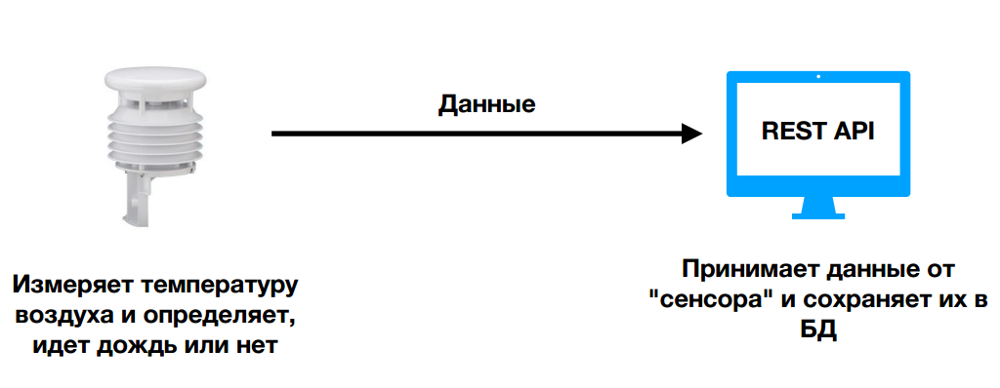
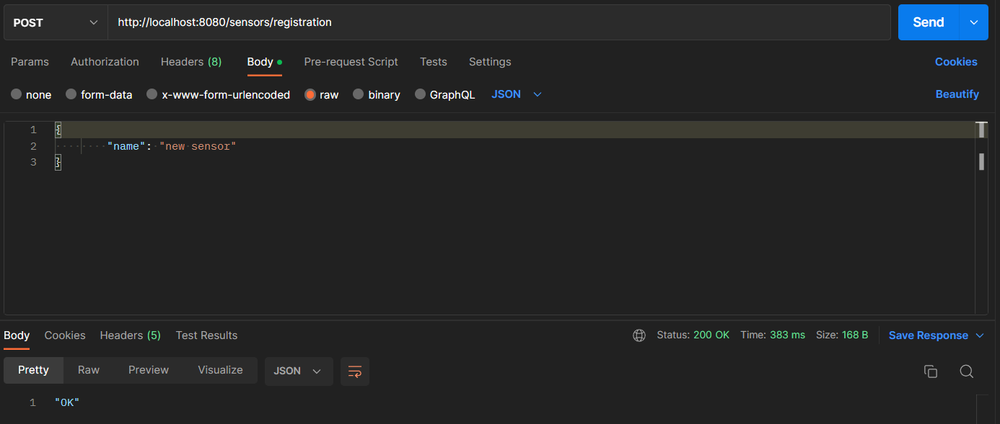
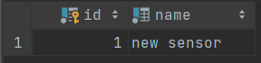
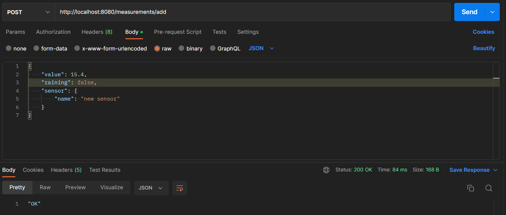
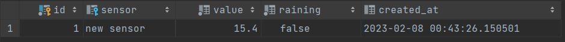
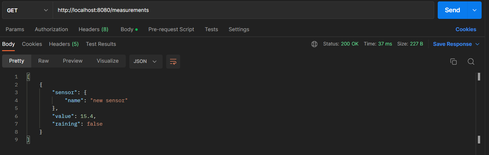
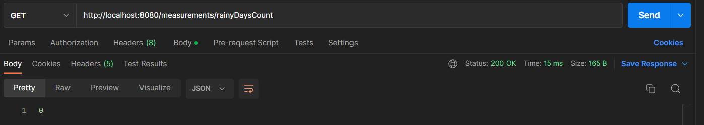
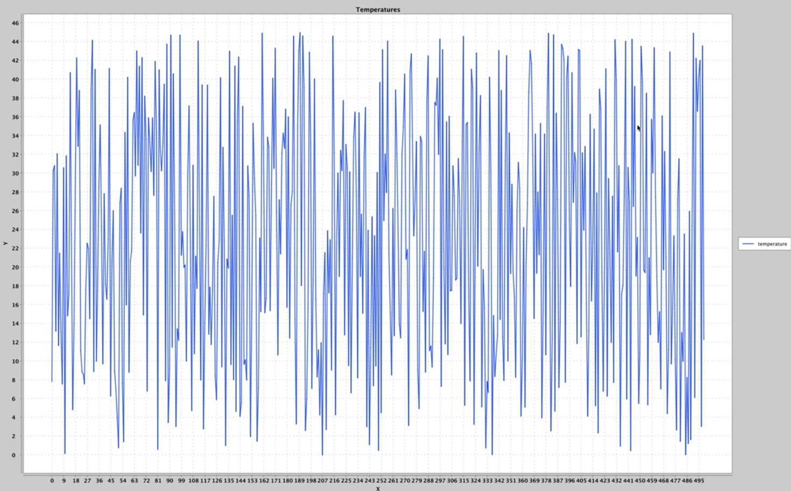

# REST API Сервис + Клиент

### Сервис принимает данные от предполагаемого метрологического сенсора, измеряющего температуру воздуха и определяет, идет дождь или нет 



## Пример работы сервиса

### Отправляем POST-запрос на адрес ```/sensors/registration```. Таким образом, регистрируем новый сенсор





### POST-запрос на адрес ```/measurements/add``` добавляет новое измерение для сенсора





### Получим все измерения, отправив GET-запрос на адрес ```/meausurements```



### Также можно получить количество дождливых дней, отправив GET-запрос на адрес ```/measurements/rainyDaysCount```



## Пример работы клиента

При помощи клиента мы можем отправлять огромное количество запросов сервису для получения или отправки данных сенсору.
К примеру, отправив 500 измерений со случайными значениями и получив их, можно построить график температур на основе этих измерений


